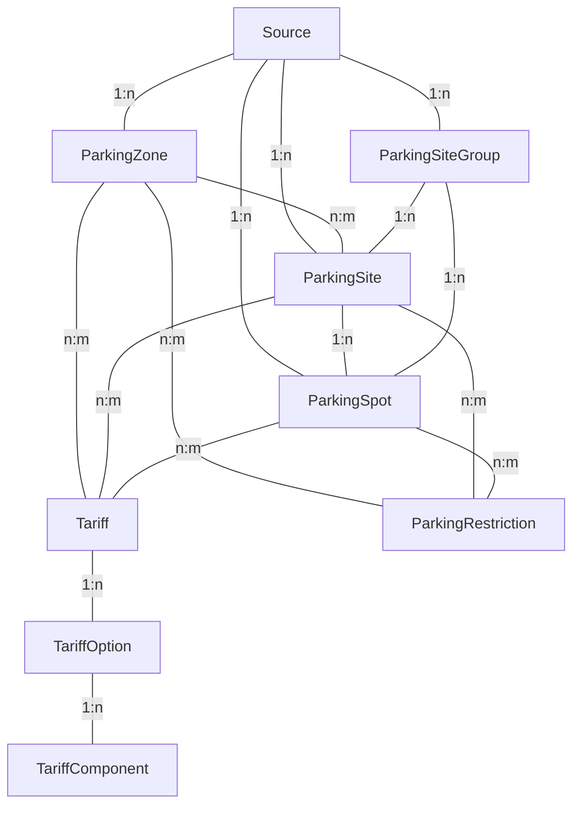

# ParkAPI datamodel

Single parking sites and on street parking are an extension to ParkAPI parking sites.



## Source

The source object represents a specific data source. Every data source has a unique identifier called `source.uid`.
The `uid` is the central identifier which defines the data handling and, at push endpoints, even the user for basic
authorization.

Additionally, every source has a human-readable name and a public URL where the user gets more information.

There are a few other fields at source, mostly related to import status including error counters and licence
information. For a complete overview, please have a look at the
[OpenAPI documentation](https://api.mobidata-bw.de/park-api/documentation/public.html#/paths/v3-parking-sites/get).

If, until now, you used the ParkAPI v1 model, you might recognize that there is a change of perspective: at v1, the
main object for collecting data was city, not source. This turned out not to be very realistic, because often there are
multiple operators per city. ParkAPI v2 changed this to a source-based approach, and added geo-based queries to
searches in order not to rely on a city as a query parameter.

## ParkingZone

A `ParkingZone` is a geographic area which defined specific properties for the whole zone. This can be tariffs as well as restrictions.

`ParkingSite`s can to be assigned to one or many ParkingZones. It’s possible that there are `ParkingSite`s within the area of the ParkingZone which are not assigned to this zone, for example underground parking within a larger off on street parking tariff zone.

| Field        | Type                                      | Cardinality | Description                                                                  |
|--------------|-------------------------------------------|-------------|------------------------------------------------------------------------------|
| uid          | str                                       | 1           | Unique uid for this source                                                   |
| geojson      | [GeoJSON Geometry](#geojson-geometry)     | ?           | Polygon/MultiPolygon                                                         |
| tariffs      | [Tariff](#tariff)                         | *           |                                                                              |
| restrictions | [ParkingRestriction](#parkingrestriction) | *           | If there are multiple options, they should be understood with an logical or. |
| name         | str                                       | ?           |                                                                              |
| abbreviation | str                                       | ?           |                                                                              |
| color        | str (hex encoded color)                   | ?           | If color is used, e.g. at parking meters                                     |

## Tariff

A `Tariff` is the whole tariff system which contains one or more tariff options. There is just one `Tariff` valid at a time. If there is any option valid for the customer, they have to take it. If there is no valid option, parking is free. Tariffs do not overrule restrictions like `max_stay` or `restrictions`.

| Field           | Type                               | Cardinality | Description                                                                                                                                   |
|-----------------|------------------------------------|-------------|-----------------------------------------------------------------------------------------------------------------------------------------------|
| uid             | str                                | 1           | Unique uid for this source                                                                                                                    |
| currency        | [str(currency)](#strcurrency)      | 1           | Currency                                                                                                                                      |
| name            | str                                | ?           | A name for this tariff                                                                                                                        |
| tax_rate        | [str (decimal(5, 4))](#strdecimal) | 1           | As fragment, 19 % is represented as `0.19`                                                                                                    |
| min_price       | [str (decimal)](#strdecimal)       | ?           | Gross value. Min price which is charged anyway.                                                                                               |
| max_price       | [str (decimal)](#strdecimal)       | ?           | Gross value. Max price which is charged anyway.                                                                                               |
| start_date_time | [str (date-time)](#strdate-time)   | ?           | When the tariff gets valid                                                                                                                    |
| end_date_time   | [str (date-time)](#strdate-time)   | ?           | When the tariff gets invalid                                                                                                                  |
| updated_at      | [str (date-time)](#strdate-time)   | 1           | Last update                                                                                                                                   |
| options         | [TariffOption](#tariffoption)      | +           | Different tariff options. The customer must take one option which is valid for them. If there is no option for the customer, parking is free. |

## TariffOption

`TariffOption`s are not additive, this means that the customer can chose any valid option they want. If there is no option, parking is free.

| Field             | Type                                | Cardinality | Description                                                                                                                                                                |
|-------------------|-------------------------------------|-------------|----------------------------------------------------------------------------------------------------------------------------------------------------------------------------|
| components        | [TariffComponent](#tariffcomponent) | +           | All valid TariffComponents apply.                                                                                                                                          |
| valid_start_time  | [str (time)](#strtime)              | ?           | Local time when the option gets valid. Has to be set together with `valid_end_time`. If neither are set, the option is valid for all day. `24:00` is an allowed value.     |
| valid_end_time    | [str (time)](#strtime)              | ?           | Local time when the option gets invalid. Has to be set together with `valid_start_time`. If neither are set, the option is valid for all day. `24:00` is an allowed value. |
| valid_day_of_week | [Weekday](#weekday)                 | *           | Ability to set the weekdays when this tariff is valid. If no weekday is set, it’s valid for all weekdays.                                                                  |
| valid_audience    | [ParkingAudience](#parkingaudience) | *           | List of audiences for which this option is valid. If no audience is set, it’s valid for all audiences.                                                                     |
| description       | str                                 | ?           |                                                                                                                                                                            |

## TariffComponent

TariffComponent are additive, this means all TariffComponent applies if they are valid.

| Field        | Type                                        | Cardinality | Description                                                                                                                       |
|--------------|---------------------------------------------|-------------|-----------------------------------------------------------------------------------------------------------------------------------|
| type         | [TariffComponentType](#tariffcomponenttype) | 1           |                                                                                                                                   |
| price        | [str (decimal)](#strdecimal)                | 1           | Gross price, per `step_size` unit if type is `TIME`                                                                               |
| step_size    | [str (duration)](#strduration)              | ?           | Step size: as soon as the time enters this amount of time, the `price` is charged. Required if type is `TIME` and price is not 0. |
| min_duration | [str (duration)](#strduration)              | ?           | Min duration for this component, just for type `TIME`.                                                                            |
| max_duration | [str (duration)](#strduration)              | ?           | Max duration for this component, just for type `TIME`.                                                                            |

## ParkingSite

`ParkingSite` represents a location where multiple parking spaces are located as a defined area or building. Every
parking site has a data source where it comes from. It also has all the relevant data which describes the parking site:
a name, an address, a url and other meta information. Additionally, it has static and, if the data source provides it,
realtime data for capacities. It also has opening times in OSM format and also, if available, a realtime opening status.
For a complete overview, please have a look at the
[OpenAPI documentation](https://api.mobidata-bw.de/park-api/documentation/public.html#/paths/v3-parking-sites/get).

This data model has its limits for on-street parking, where there is no user-visible area which creates the
borders of a specific parking site. Usually, there are definitions for areas like parts of streets, which also apply
on fees or rules for this area, so it's a good idea to stick to them instead of importing every single parking space as
a whole parking site.

There is a limit if it comes to attributes of parking spots: it's simple to define capacities for a single defined
attribute, like family parking or parking with a charge station. The difficulty begins if there are parking spaces with
multiple attributes at once, for example one parking spot which is for families and has a charge station at the same
time. A possible solution would be to extend the data model to a parking space perspective, where every single parking
space has a representation in the data model. Most data sources are not able to provide such in-detail information, so
in order to provide data in a more consistent way, we decided against this (in the first place).

A `ParkingSite` needs the following extension fields in addition to the existing fields:

| Field                    | Type                                                                  | Cardinality | Descrption                                                                                                                                                |
|--------------------------|-----------------------------------------------------------------------|-------------|-----------------------------------------------------------------------------------------------------------------------------------------------------------|
| uid                      | str                                                                   | 1           | Unique uid for this source                                                                                                                                |
| name                     | str                                                                   | 1           |                                                                                                                                                           |
| static_data_updated_at   | [string (date-time)](#strdate-time)                                   | 1           |                                                                                                                                                           |
| has_realtime_data        | bool                                                                  | 1           |                                                                                                                                                           |
| realtime_data_updated_at | [string (date-time)](#strdate-time)                                   | ?           | Required has_realtime_data is true                                                                                                                        |
| realtime_opening_status  | [OpeningStatus](#openingstatus)                                       | ?           | Required has_realtime_data is true                                                                                                                        |
| operator_name            | str                                                                   | ?           |                                                                                                                                                           |
| public_url               | str(url)                                                              | ?           | URL for human users to get more details about this parking site.                                                                                          |
| type                     | [ParkingSiteType](#parkingsitetype)                                   | ?           |                                                                                                                                                           |
| description              | str                                                                   | ?           |                                                                                                                                                           |
| address                  | str                                                                   | ?           | Full address including street postalcode and city. Preferable in format {street with number}, {postalcode} {city}                                         |
| max_height               | int                                                                   | ?           | Max height, in centimeters.                                                                                                                               |
| max_width                | int                                                                   | ?           | Max width, in centimeters.                                                                                                                                |
| has_lighting             | bool                                                                  | ?           |                                                                                                                                                           |
| fee_description          | str                                                                   | ?           |                                                                                                                                                           |
| park_and_ride_type       | [ParkAndRideType](#parkandridetype)                                   | *           |                                                                                                                                                           |
| supervision_type         | [SupervisionType](#supervisiontype)                                   | ?           |                                                                                                                                                           |
| photo_url                | str(url)                                                              | ?           |                                                                                                                                                           |
| related_location         | str                                                                   | ?           | A related location like a school.                                                                                                                         |
| opening_hours            | str (OSM OH) string                                                   | ?           |                                                                                                                                                           |
| lat                      | float                                                                 | 1           | lat                                                                                                                                                       |
| lon                      | float                                                                 | 1           | lon                                                                                                                                                       |
| geojson                  | [GeoJSON Geometry](#geojson-geometry)                                 | ?           | Polygon to describe the ParkingSite. The center of this shape will be calculated to the point if the point is not given explicitly.                       |
| tariffs                  | [Tariff](#tariff)                                                     | *           |                                                                                                                                                           |
| restrictions             | ParkingRestriction                                                    | *           | If there are multiple options, they should be understood with an logical or. If there are multiple options, they should be understood with an logical or. |
| purpose                  | [PurposeType](#purposetype)                                           | 1           |                                                                                                                                                           |
| capacity                 | int                                                                   | 1           |                                                                                                                                                           |
| capacity_min             | int                                                                   | ?           | The min capacity if there is a uncertainty of measurement                                                                                                 |
| capacity_max             | int                                                                   | ?           | The max capacity if there is a uncertainty of measurement                                                                                                 |
| realtime_capacity        | int                                                                   | ?           |                                                                                                                                                           |
| realtime_free_capacity   | int                                                                   | ?           |                                                                                                                                                           |
| parking_type             | [LinearParkingSiteSideParkingType](#linearparkingsitesideparkingtype) | ?           | How the car is parked                                                                                                                                     |
| orientation              | [LinearParkingSiteSideOrientation](#linearparkingsitesideorientation) | ?           | How the car is parked in relation to driving direction                                                                                                    |
| side                     | [LinearParkingSiteSideType](#linearparkingsitesidetype)               | ?           |                                                                                                                                                           |
| external_identifiers     | ExternalIdentifier                                                    | *           |                                                                                                                                                           |
| tags                     | str                                                                   | *           |                                                                                                                                                           |

## ParkingRestriction

| Field                  | Type                                | Cardinality | Description                                                                                                                                                                                  |
|------------------------|-------------------------------------|-------------|----------------------------------------------------------------------------------------------------------------------------------------------------------------------------------------------|
| type                   | [ParkingAudience](#parkingaudience) | ?           | If type is not set, all audiences are restricted.                                                                                                                                            |
| hours                  | [str (OSM OH)](#str-osm-oh)         | ?           | OSM-OpeningHours formatted string, that describes when the restriction applies. If none is given, this corresponds to 24/7. If hours are set, all other times are not available for parking. |
| max_stay               | [str (duration)](#strduration)      | ?           | Maximum stay period.                                                                                                                                                                         |
| capacity               | int                                 | ?           | Amount of parking spaces where the restriction applies.                                                                                                                                      |
| realtime_capacity      | int                                 | ?           |                                                                                                                                                                                              |
| realtime_free_capacity | int                                 | ?           |                                                                                                                                                                                              |

## ParkingSpot

The `ParkingSpot` represents a single spot for a single car / bike. The only required relation is between `Source` and `ParkingSpot`, because every dataset needs a source where it comes from. It’s recommended to group `ParkingSpot` s at least to `ParkingSite`s, though, because in most times, it reflects reality: on street parking is usually a group of parking spots at one street.

| Field                    | Type                                              | Cardinality | Description                                                                                                       |
|--------------------------|---------------------------------------------------|-------------|-------------------------------------------------------------------------------------------------------------------|
| uid                      | str                                               | 1           | Unique uid for this source                                                                                        |
| lat                      | float                                             | 1           | lat                                                                                                               |
| lon                      | float                                             | 1           | lon                                                                                                               |
| name                     | str                                               | ?           |                                                                                                                   |
| type                     | ParkingSpotType                                   |             |                                                                                                                   |
| parking_site_uid         | str                                               | ?           | Refererence to ParkingSite. Will be outputted as `parking_site_id`.                                               |
| address                  | str                                               | ?           | Full address including street postalcode and city. Preferable in format {street with number}, {postalcode} {city} |
| geojson                  | [GeoJSON Geometry](#geojson-geometry)             | ?           | Polygon to describe                                                                                               |
| purpose                  | [PurposeType](#purposetype)                       | 1           |                                                                                                                   |
| static_data_updated_at   | string (date-time)                                | 1           |                                                                                                                   |
| realtime_status          | [ParkingSpotStatus](#parkingspotstatus)           | ?           |                                                                                                                   |
| realtime_data_updated_at | string (date-time)                                | ?           |                                                                                                                   |
| restrictions             | [ParkingSpotRestriction](#parkingspotrestriction) | *           | If there are multiple options, they should be understood with an logical or.                                      |
| tariffs                  | [Tariff](#tariff)                                 | *           |                                                                                                                   |
| external_identifiers     | ExternalIdentifier                                | *           |                                                                                                                   |
| tags                     | str                                               | *           |                                                                                                                   |

## ParkingSpotRestriction

| Field    | Type                                | Cardinality | Description                                                                                                                                                                                  |
|----------|-------------------------------------|-------------|----------------------------------------------------------------------------------------------------------------------------------------------------------------------------------------------|
| type     | [ParkingAudience](#parkingaudience) | ?           | If type is not set, all audiences are restricted.                                                                                                                                            |
| hours    | [str (OSM OH)](#str-osm-oh)         | ?           | OSM-OpeningHours formatted string, that describes when the restriction applies. If none is given, this corresponds to 24/7. If hours are set, all other times are not available for parking. |
| max_stay | [str (duration)](#strduration)      | ?           | Maximum stay period.                                                                                                                                                                         |

## ParkingSiteGroup

A generic grouping of several `ParkingSite` or `ParkingSpot` objetcs.

## PurposeType

* CAR
* BIKE
* MOTORCYCLE
* ITEM

## ParkingSiteType

* ON_STREET
* OFF_STREET_PARKING_GROUND
* UNDERGROUND
* CAR_PARK
* WALL_LOOPS
* SAFE_WALL_LOOPS
* STANDS
* LOCKERS
* SHED
* TWO_TIER
* BUILDING
* FLOOR
* LOCKBOX
* OTHER

## ParkAndRideType

* CARPOOL
* TRAIN
* BUS
* TRAM
* YES
* NO

## OpeningStatus

* OPEN
* CLOSED
* UNKNOWN

## SupervisionType

* YES
* NO
* VIDEO
* ATTENDED

## Weekday

* MONDAY
* TUESDAY
* WEDNESDAY
* THURSDAY
* FRIDAY
* SATURDAY
* SUNDAY

## LinearParkingSiteSideType

* LEFT
* RIGHT
* BOTH

## LinearParkingSiteSideParkingType

* LANE
* ON_KERB
* HALF_ON_KERB
* SHOULDER

## LinearParkingSiteSideOrientation

* PARALLEL
* DIAGONAL
* PERPENDICULAR

## ParkingSpotStatus

* AVAILABLE
* TAKEN
* UNKNOWN

## ParkingSpotType

* ON_STREET
* OFF_STREET_PARKING_GROUND
* UNDERGROUND
* CAR_PARK
* LOCKERS
* LOCKBOX

## ParkingAudience

* DISABLED
* WOMEN
* FAMILY
* CARSHARING
* CHARGING
* TAXI
* DELIVERY
* TRUCK
* BUS
* CUSTOMER
* RESIDENT

## TariffComponentType

* FLAT: constant fee, charged one time
* TIME: time based fee, charged depending on duration

## Generic data types

### str (OSM OH)

Opening hours described in [OSM format](https://wiki.openstreetmap.org/wiki/Key:opening_hours). Examples:

* `Mo-Fr 08:00-17:00`
* `Mo,We 08:00-12:00`

### str(duration)

Duration is based on ISO 8601 format. Examples:

* `P1H`
* `P5H30M`.

### str(date-time)

Date-Time is based on ISO 8601 format. We recommend time-zone aware datetimes. Examples:

* `2007-08-31T16:47+00:00` for UTC datetime
* `2007-08-31T16:47Z` for UTC datetime, `Z` representation
* `2007-08-31T16:47+02:00` for a local timezone
* `2007-08-31T16:47` for a not recommended non aware datetime.

### str(time)

Time based on ISO 8601 format. Examples:

* `10:00`

### str(currency)

Currency based on ISO 4217 format. Examples:

* `EUR`
* `CHF`

### str(decimal)

String representation of a decimal value. Not a float to prevent float rounding issues. Examples:

* `0.20`
* `10.30`.

### str(url)

String representation of an [URL](https://de.wikipedia.org/wiki/Uniform_Resource_Locator). Example:

* `https://mobidata-bw.de/`

### GeoJSON Geometry

GeoJSON geometry is the `geometry` part of a GeoJSON `feature`. Example:

```json
{
    "type": "LineString",
    "coordinates": [[9.15489,47.704448],[9.178068,47.699018]]
}
```

## Examples

### ParkingZone

Parking zone for 3 hours max parking, and 2 € per hour.

```json
{
    "uid": "6685f7a1-fd90-4dab-a4fe-89f7fe5e3b0b",
    "geojson": {
        "type": "Polygon",
        "coordinates": [[[9.184274,47.68261],[9.194921,47.678334], [9.198871,47.68365], [9.184274,47.68261]]]
    },
    "tariffs": [
        {
            "uid": "tariff-1",
            "currency": "EUR",
            "tax_rate": "0.19",
            "updated_at": "2024-11-11T11:11:11Z",
            "options": [
                {
                    "components": [
                        {
                            "type": "TIME",
                            "price": "2.00",
                            "step_size": "P1H"
                        }
                    ],
                    "valid_start_time": "08:00",
                    "valid_end_time": "18:00"
                }
            ]
        }
    ],
    "restrictions": [
        {
            "max_stay": "P3H"
        }
    ],
    "name": "Parkzone City Center",
    "color": "0000FF"
}
```

### ParkingSite

Simple parking sites with 100 parking spots.

```json
{
    "uid": "6685f7a1-fd90-4dab-a4fe-89f7fe5e3b0b",
    "name": "Parking Site 1",
    "static_data_updated_at": "2020-01-01T00:00:00Z",
    "purpose": "CAR",
    "has_realtime_data": false,
    "capacity": 100,
    "lat": "48.783333",
    "lon": "9.183333"
}
```

Parking sites with 100 parking spots, all of them restricted to women.

```json
{
    "uid": "6685f7a1-fd90-4dab-a4fe-89f7fe5e3b0b",
    "name": "Parking Site 1",
    "static_data_updated_at": "2020-01-01T00:00:00Z",
    "purpose": "CAR",
    "has_realtime_data": false,
    "capacity": 100,
    "lat": "48.783333",
    "lon": "9.183333",
    "restrictions": [
        {
            "type": "WOMEN"
        }
    ]
}
```

Simple parking sites with 100 parking spots, all of them restricted to max 4h, 10 of them restricted to women.

```json
{
    "uid": "6685f7a1-fd90-4dab-a4fe-89f7fe5e3b0b",
    "name": "Parking Site 1",
    "static_data_updated_at": "2020-01-01T00:00:00Z",
    "purpose": "CAR",
    "has_realtime_data": false,
    "capacity": 100,
    "lat": "48.783333",
    "lon": "9.183333",
    "restrictions": [
        {
            "max_stay": "P4H"
        },
        {
            "type": "WOMEN",
            "capacity": 10,
            "max_stay": "P4H"
        }
    ]
}
```

Simple parking sites with 100 parking spots, per default restricted to max 4h, 10 of them restricted to women without
time limit.

```json
{
    "uid": "6685f7a1-fd90-4dab-a4fe-89f7fe5e3b0b",
    "name": "Parking Site 1",
    "static_data_updated_at": "2020-01-01T00:00:00Z",
    "purpose": "CAR",
    "has_realtime_data": false,
    "capacity": 100,
    "lat": "48.783333",
    "lon": "9.183333",
    "restrictions": [
        {
            "max_stay": "P4H"
        },
        {
            "type": "WOMEN",
            "capacity": 10
        }
    ]
}
```

A on-street parking polygon for 3 hours max parking, and 2 € per hour.

```json
{
    "uid": "8c7a33b0-c44b-4d3b-8486-40011bbab5ef",
    "purpose": "CAR",
    "name": "Example parking",
    "type": "ON_STREET",
    "has_realtime_data": false,
    "static_data_updated_at": "2025-01-01T03:05:07Z",
    "capacity": 10,
    "lat": "48.783333",
    "lon": "9.183333",
    "geojson": {
        "type": "Polygon",
        "coordinates": [[[9.184274,47.68261],[9.194921,47.678334], [9.198871,47.68365], [9.184274,47.68261]]]
    },
    "tariffs": [
        {
            "uid": "tariff-1",
            "currency": "EUR",
            "tax_rate": "0.19",
            "updated_at": "2024-11-11T11:11:11Z",
            "options": [
                {
                    "components": [
                        {
                            "type": "TIME",
                            "price": "2.00",
                            "step_size": "P1H"
                        }
                    ],
                    "valid_start_time": "08:00",
                    "valid_end_time": "18:00"
                }
            ]
        }
    ],
    "restrictions": [
        {
            "max_stay": "P3H"
        }
    ]
}
```

### ParkingSpot

```json
{
    "uid": "ceafde8f-e247-4937-89e7-67969af8214f",
    "lat": "48.783333",
    "lon": "9.183333",
    "purpose": "CAR",
    "static_data_updated_at": "2025-01-01T03:05:07Z",
    "realtime_status": "TAKEN",
    "realtime_data_updated_at": "2025-01-01T03:05:07Z",
    "restrictions": [
        {
            "type": "DISABLED"
        }
    ]
}
```

### Tariffs

2 € for every hour entered into from 8 - 18 o’Clock

```json
[
    {
        "uid": "tariff-1",
        "currency": "EUR",
        "tax_rate": "0.19",
        "updated_at": "2024-11-11T11:11:11Z",
        "options": [
            {
                "components": [
                    {
                        "type": "TIME",
                        "price": "2.00",
                        "step_size": "P1H"
                    }
                ],
                "valid_start_time": "08:00",
                "valid_end_time": "18:00"
            }
        ]
    }
]
```

2 € for every hour entered into from 8 - 18 o’Clock, 0,50 € service fee:

```json
[
    {
        "uid": "tariff-2",
        "currency": "EUR",
        "tax_rate": "0.19",
        "updated_at": "2024-11-11T11:11:11Z",
        "options": [
            {
                "components": [
                    {
                        "type": "FLAT",
                        "price": "0.50"
                    },
                    {
                        "type": "TIME",
                        "price": "2.00",
                        "step_size": "P1H"
                    }
                ],
                "valid_start_time": "08:00",
                "valid_end_time": "18:00"
            }
        ]
    }
]
```

2 € for every hour entered into from 8 - 18 o’Clock, except for sunday, there it’s 12 - 18 o’Clock. First 30 Minutes free.

```json
[
    {
        "uid": "tariff-3",
        "currency": "EUR",
        "tax_rate": "0.19",
        "updated_at": "2024-11-11T11:11:11Z",
        "options": [
            {
                "components": [
                    {
                        "type": "TIME",
                        "price": "0.00",
                        "max_duration": "PT30M"
                    },
                    {
                        "type": "TIME",
                        "price": "2.00",
                        "step_size": "P1H",
                        "min_duration": "PT30M"
                    }
                ],
                "valid_start_time": "08:00",
                "valid_end_time": "18:00",
                "valid_day_of_week": ["MONDAY", "TUESDAY", "WEDNESDAY", "THURSDAY", "FRIDAY", "SATURDAY"]
            },
            {
                "components": [
                    {
                        "type": "TIME",
                        "price": "0.00",
                        "max_duration": "PT30M"
                    },
                    {
                        "type": "TIME",
                        "price": "2.00",
                        "step_size": "P1H",
                        "min_duration": "PT30M"
                    }
                ],               
                "valid_start_time": "12:00",
                "valid_end_time": "18:00",
                "valid_day_of_week": ["SUNDAY"]
            }
        ]
    }
]
```

2 € for every hour entered into from 8 - 18 o’Clock, changing to 3 € for every hour entered into from 8 - 18 o’Clock at new year:

```json
[
    {
        "uid": "tariff-4",
        "currency": "EUR",
        "tax_rate": "0.19",
        "updated_at": "2024-11-11T11:11:11Z",
        "end_date_time": "2025-12-31T23:00:00Z",
        "options": [
            {
                "components": [
                    {
                        "type": "TIME",
                        "price": "2.00",
                        "step_size": "P1H"
                    }
                ],
                "valid_start_time": "08:00",
                "valid_end_time": "18:00"
            }
        ]
    },
    {
        "uid": "tariff-5",
        "currency": "EUR",
        "tax_rate": "0.19",
        "start_date_time": "2025-12-31T23:00:00Z",
        "updated_at": "2024-11-11T11:11:11Z",
        "options": [
            {
                "components": [
                    {
                        "type": "TIME",
                        "price": "3.00",
                        "step_size": "P1h"
                    }
                ],
                "valid_start_time": "08:00",
                "valid_end_time": "18:00"
            }
        ]
    }
]
```

2 € for every hour entered into from 8 - 18 o’Clock, residents park free.

```json
[
    {
        "uid": "tariff-6",
        "currency": "EUR",
        "tax_rate": "0.19",
        "updated_at": "2024-11-11T11:11:11Z",
        "options": [
            {
                "components": [
                    {
                        "type": "TIME",
                        "price": "2.00",
                        "step_size": "P1H"
                    }
                ],
                "valid_start_time": "08:00",
                "valid_end_time": "18:00"
            },
            {
                "components": [
                    {
                        "type": "TIME",
                        "price": "0.00"
                    }
                ],
                "valid_start_time": "08:00",
                "valid_end_time": "18:00",
                "valid_audience": ["RESIDENT"]
            }
        ]
    }
]
```

2 € for every hour entered hour from 8 - 18 o’Clock, customers get 2 hours free parking:

```json
[
    {
        "uid": "tariff-7",
        "currency": "EUR",
        "tax_rate": "0.19",
        "updated_at": "2024-11-11T11:11:11Z",
        "options": [
            {
                "components": [
                    {
                        "type": "TIME",
                        "price": "0.00",
                        "max_duration": "P2H"
                    },
                    {
                        "type": "TIME",
                        "price": "2.00",
                        "step_size": "P1H",
                        "min_duration": "P2H"
                    }
                ],
                "valid_start_time": "08:00",
                "valid_end_time": "18:00",
                "valid_audience": ["CUSTOMER"]
            },
            {
                "components": [
                    {
                        "type": "TIME",
                        "price": "2.00",
                        "step_size": "P1H"
                    }
                ],
                "valid_start_time": "08:00",
                "valid_end_time": "18:00"
            }
        ]
    }
]
```

2 € for every entered hour from 8 - 18 o’Clock, 10 € for a day ticket:

```json
[
    {
        "uid": "tariff-8",
        "currency": "EUR",
        "tax_rate": "0.19",
        "updated_at": "2024-11-11T11:11:11Z",
        "options": [
            {
                "components": [
                    {
                        "type": "TIME",
                        "price": "2.00",
                        "step_size": "P1H"
                    }
                ],
                "valid_start_time": "08:00",
                "valid_end_time": "18:00"
            },
            {
                "components": [
                    {
                        "type": "TIME",
                        "price": "10.00",
                        "step_size": "P1D"
                    }
                ],
                "valid_start_time": "08:00",
                "valid_end_time": "18:00"
            }
        ]
    }
]
```

0,10 € for every entered 10 Minutes for the first 2 hours, afterwards 2 € for every entered hour from 8 - 18 o’Clock … does not work. Could be modelld like this, but that gets even more complicated:

```json
[
    {
        "uid": "tariff-9",
        "currency": "EUR",
        "tax_rate": "0.19",
        "updated_at": "2024-11-11T11:11:11Z",
        "options": [
            {
                "components": [
                    {
                        "type": "TIME",
                        "price": "0.10",
                        "step_size": "10m",
                        "max_duration": "2h"
                    },
                    {
                        "type": "TIME",
                        "price": "2.00",
                        "step_size": "1h",
                        "min_duration": "2h"
                    }
                ],
                "valid_start_time": "08:00",
                "valid_end_time": "18:00"
            }
        ]
    }
]
```

1 € for the first hour, 2 € / hour for every hour afterwards:

```json
[
    {
        "uid": "tariff-10",
        "currency": "EUR",
        "tax_rate": "0.19",
        "updated_at": "2024-11-11T11:11:11Z",
        "options": [
            {
                "components": [
                    {
                        "type": "TIME",
                        "price": "1.00",
                        "step_size": "1h",
                        "max_duration": "1h"
                    },
                    {
                        "type": "TIME",
                        "price": "2.00",
                        "step_size": "1h",
                        "min_duration": "1h"
                    }
                ],
                "valid_start_time": "08:00",
                "valid_end_time": "18:00"
            }
        ]
    }
]
```
